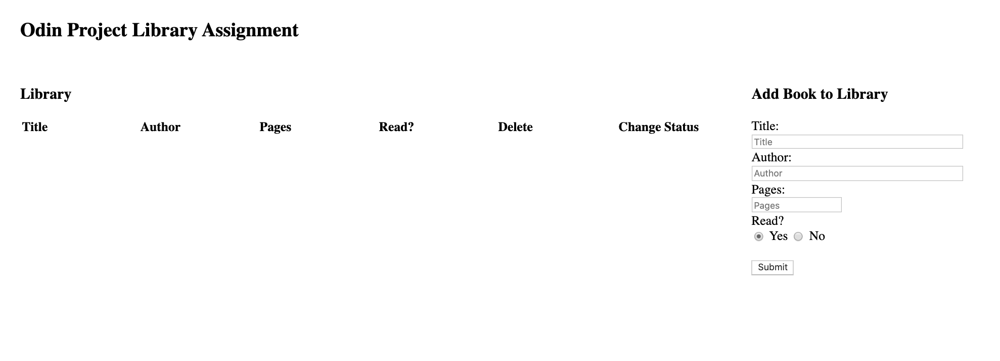

Library Project from the Odin Project: https://www.theodinproject.com/courses/javascript/lessons/library

Live: https://morrisrob.github.io/library/

CRUD Javascript library app.  Data does not persist.  This app has functionality to add books, change read/unread status, and delete.  

